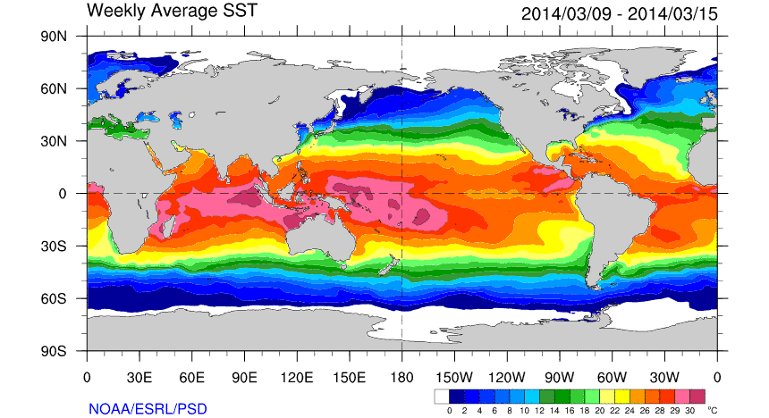
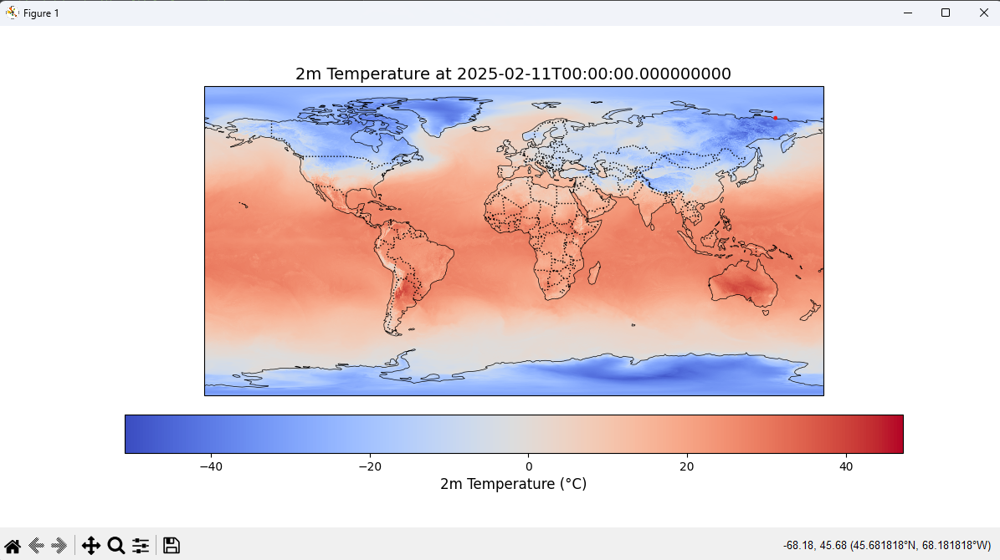
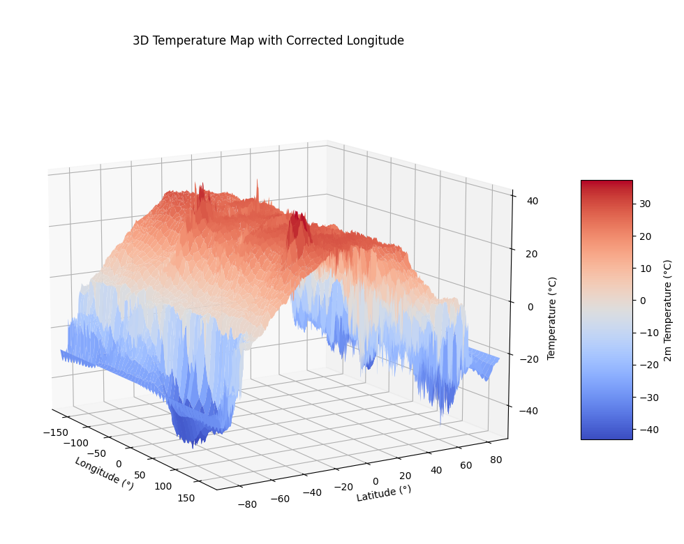
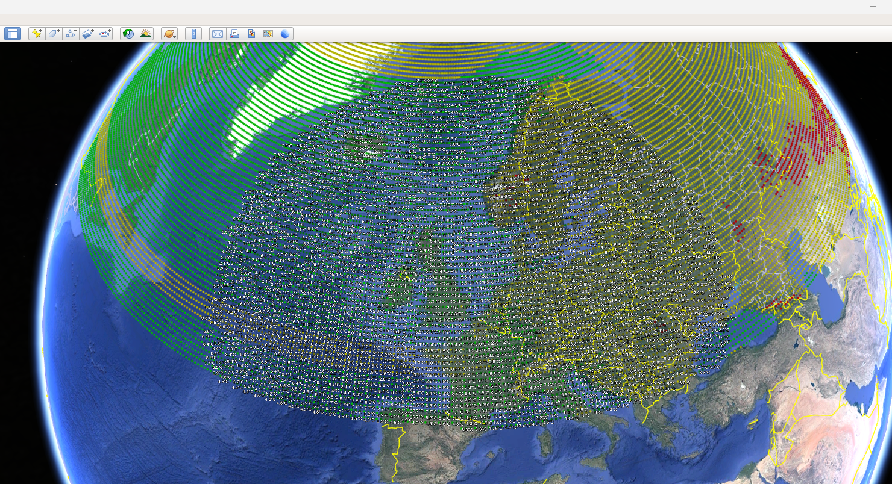

<h1 style="font-size: 40px;"> 🌽🌐 Louis Dreyfus Company - Data Engineering Test 💻 🌱</h1>

## **GRIB2 Data Processing & Visualization**



📌 **Author:** Pedro Mendes
📌 **Email:** [petter.mendes@outlook.com](mailto:petter.mendes@outlook.com)

---

## 📖 **Overview**

This repository contains a **Python-based workflow** for processing, analyzing, and visualizing **GRIB2 meteorological data**. The code extracts key insights from weather forecasts, converts data into different formats (GeoTIFF, CSV, Zarr), and generates visualizations (GIF, 3D maps, and KML for Google Earth).

This test is structured to demonstrate **data engineering skills** by:

- Handling **large datasets** efficiently using `xarray`, `cfgrib`, and `rioxarray`.
- Implementing **structured logging** with a **custom color-coded formatter**.
- Performing **data cleaning, merging, and transformations** to improve usability.
- Optimizing performance by managing **memory usage and garbage collection**.
- Generating **high-quality visualizations** (animated temperature maps, 3D plots).
- Exporting **multi-format outputs** for GIS and cloud-based applications.

---

## ⚙️ **Installation & Dependencies**

### 1️⃣ **Clone the Repository**

```sh
git clone https://github.com/yourusername/louis-dreyfus-data-test.git
cd louis-dreyfus-data-test
```

### 2️⃣ **Create a Virtual Environment (Optional)**

```sh
python -m venv env
source env/bin/activate  # On macOS/Linux
env\Scripts\activate  # On Windows
```

### 3️⃣ **Install Required Libraries**

```sh
pip install -r requirements.txt
```

📌 **Dependencies**:

- `xarray`, `cfgrib`, `rioxarray`, `eccodes`
- `matplotlib`, `cartopy`, `numpy`
- `colorama`, `logging`, `glob`, `os`, `datetime`

---

## 🚀 **How to Run**

### **1️⃣ Run the main processing script**

```sh
python main.py
```

- This will process **GRIB2 files** from `./Data/` directory.
- It logs progress to `grib2_processing.log` and the console.
- The final dataset is saved as **NetCDF, CSV, and Zarr**.

### **2️⃣ Generate a GIF of Temperature Evolution**

```sh
python generate_gif.py
```

- Creates `temperature_forecast.gif`, showing temperature changes over time.

### **3️⃣ Create a 3D Temperature Map**

```sh
python generate_3d_map.py
```

- Produces a **3D surface plot** of temperature data.

### **4️⃣ Export Data for Google Earth (KML)**

```sh
python export_to_kml.py
```

- Saves `temperature_data.kml`, allowing visualization in **Google Earth**.

---

## 🛠 **Project Structure**

```
📂 louis-dreyfus-data-test/
│── 📂 Data/                 # GRIB2 files directory
│── 📂 Outputs/              # Processed data (NetCDF, CSV, GIF, KML, etc.)
│── 📜 main.py               # Core data processing script
│── 📜 generate_gif.py       # GIF animation script
│── 📜 generate_3d_map.py    # 3D visualization script
│── 📜 export_to_kml.py      # Google Earth export script
│── 📜 requirements.txt      # Python dependencies
│── 📜 README.md             # Project documentation
│── 📜 grib2_processing.log  # Execution logs
```

---

## 📊 **Sample Outputs**

### **GIF of Temperature Forecast**



### **3D Temperature Map**



### **Google Earth KML Visualization**



---

## 🛠 **Performance Considerations**

✅ **Efficient Memory Handling**

- Uses `tempfile` to **store intermediate NetCDF files**, reducing RAM usage.
- Implements **garbage collection** (`gc.collect()`) to prevent memory leaks.

✅ **Error Handling**

- Uses `try-except` blocks to **gracefully handle file errors**.
- **Retries failed deletions** of temporary files (avoiding permission errors).

✅ **Optimized File Handling**

- **Multi-file dataset merging** using `xr.open_mfdataset()`.
- Saves **only essential variables** to reduce output file size.

---

## ⚠️ **Troubleshooting**

| Issue                               | Solution                                             |
| ----------------------------------- | ---------------------------------------------------- |
| `FileNotFoundError: No such file` | Ensure `./Data/` contains valid GRIB2 files.       |
| `PermissionError: File in use`    | Wait & retry, or delete temp files manually.         |
| `MemoryError`                     | Reduce dataset size or increase RAM/swap memory.     |
| `Google Earth labels overlap`     | Modify `export_to_kml.py` to reduce point density. |

---

## 🚀 **Future Enhancements**

- ✅ Implement **Dask** for parallelized GRIB2 processing.
- ✅ Add **more GIS projections** (EPSG:4326, UTM, etc.).
- ✅ Improve **KML visualization** with clusters instead of individual markers.
- ✅ Optimize **large-scale data handling** using Apache Parquet.

---

## 🎯 **Conclusion**

This project demonstrates **efficient data engineering techniques** for **large-scale meteorological data processing**. It covers **end-to-end data extraction, transformation, visualization, and export**, showcasing **best practices in Python, xarray, and GIS tools**.

**📬 Questions? Reach out at [petter.mendes@outlook.com](mailto:petter.mendes@outlook.com).** 🚀
